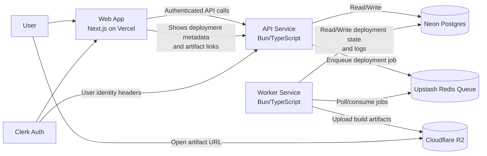

# Deploy Grid

Deploy Grid is a full-stack deployment platform for static/frontend projects.

At a high level, users connect a repository, trigger deployments, and the system builds the project in a worker, uploads artifacts to object storage, and exposes build status/logs in a web dashboard.

## High-Level Architecture

## Core Services

- **Frontend (`web/`)**
  - Next.js dashboard for projects, deployments, and logs.
  - Uses Clerk for authentication.
  - Calls API for all project/deployment operations.

- **API (`api/`)**
  - Handles project/deployment CRUD and validation.
  - Persists state in Neon Postgres.
  - Pushes build jobs to Upstash Redis queue.
  - Exposes health and deployment/log endpoints.

- **Worker (`worker/`)**
  - Continuously consumes queued deployment jobs.
  - Clones repo, installs dependencies, runs build.
  - Uploads output artifacts to Cloudflare R2.
  - Updates deployment status/logs in Neon Postgres.

## Data & Infrastructure

- **Neon Postgres**: source of truth for projects, deployments, build jobs, and logs.
- **Upstash Redis**: job queue between API and worker.
- **Cloudflare R2**: stores build artifacts (`index.html`, JS/CSS assets, etc.).
- **Vercel**: hosts the frontend.
- **Azure Container Apps / VM (typical setup)**: hosts API and worker.

## Deployment Flow (High Level)

1. User creates a deployment from the web app.
2. API creates deployment/build-job records in Neon and enqueues a job in Upstash.
3. Worker picks the job, runs build steps, and uploads artifacts to R2.
4. Worker marks deployment as ready/failed and stores logs in Neon.
5. Web app displays live deployment status and artifact URL to the user.

## Repository Structure

- [api/](api/)
- [worker/](worker/)
- [web/](web/)

This README is intentionally high-level. See service-level READMEs inside each folder for implementation details.
